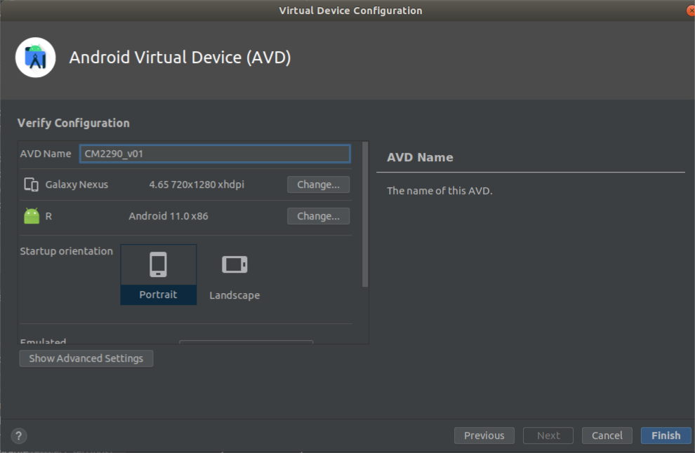
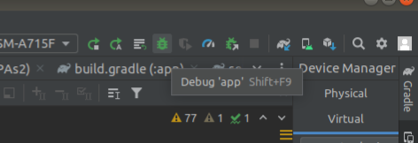

# Video encoding and decoding for camera based usecase 
## Introduction
This project demonstrates android application development for encoding raw video captured by a camera present on the CM2290 board by using different encoding techniques such as H263, H264, H265, MPEG4 and decode it into the required format. 

## Prerequisites 
- Download and install Android Studio on host system. Refer link: https://developer.android.com/studio?gclid=EAIaIQobChMI8qLmyajE-wIVmX4rCh1npgMDEAAYASAAEgLQAPD_BwE&gclsrc=aw.ds. 
- Install Android Platform tools (ADB, Fastboot) on the host system. 
- Connect the Wi-Fi 
- Download and Install the Application Tool chain SDK. (Setup instructions can be found in Application SDK User Manual). 
- Install vyser for screen mirroring .  Refer link 
https://www.vysor.io/download/linux 

## 1. Steps to create android application 
### 1.1 Clone the project
### 1.2 Open project in android studio 
1. Open android studio 
2. Click on File-> open-> select <FOLDER_TO_OPEN>->  OK-> open in New_window

`Note : Wait till Gradle sync finishes successfully.   `

### 1.3 Gradle file 
- Set sdk directory in local.properties file  

```sh
sdk.dir=<PATH_TO>/Android/Sdk 
```

### 1.4 Manifest declarations 
make sure that manifest file has the appropriate declarations to allow use of camera hardware and other related features. 
- Camera Permission  
Your application must request permission to use a device camera. 
```sh
<uses-permission android:name="android.permission.CAMERA" /> 
```
- Camera Features  
Your application must also declare use of camera features, for example:  
```sh
<uses-feature android:name="android.hardware.camera" /> 
```
- Storage Permission  
Your application can save images or videos to the device's external storage (SD Card)  
```sh
<uses-permission android:name="android.permission.WRITE_EXTERNAL_STORAGE" /> 
```
- Audio Recording Permission  
For recording audio with video capture, your application must request the audio capture permission 
```sh 
<uses-permission android:name="android.permission.RECORD_AUDIO" /> 
```
 - Change the contents in application tag as shown below 
```sh
<application 
    android:allowBackup="true" 
    android:dataExtractionRules="@xml/data_extraction_rules" 
    android:fullBackupContent="@xml/backup_rules" 
    android:icon="@mipmap/ic_launcher" 
    android:label="@string/app_name" 
    android:roundIcon="@mipmap/ic_launcher_round" 
    android:supportsRtl="true" 
    android:theme="@style/Theme.CamPAs2" 
    tools:targetApi="31"> 
    <activity 
        android:name=".MainActivity" 
        android:exported="true" 
 
        android:screenOrientation="landscape"> 
        <intent-filter> 
            <action android:name="android.intent.action.MAIN" /> 
            <category android:name="android.intent.category.LAUNCHER" /> 
        </intent-filter> 
 
        <meta-data 
            android:name="android.app.lib_name" 
            android:value="" /> 
    </activity> 
</application> 
```
 
### 1.5 Building Camera 
Below are the steps for creating a custom camera interface for your application 
- Detect Camera -  
Check for the existence of cameras and request access. 
```
/** Check if this device has a camera */ 
private boolean checkCameraHardware(Context context) { 
    if (context.getPackageManager().hasSystemFeature(PackageManager.FEATURE_CAMERA_ANY)){ 
        // this device has a camera 
        return true; 
    } else { 
        // no camera on this device 
        return false; 
    } 
} 
```
- Access cameras 
```
/** A safe way to get an instance of the Camera object. */ 
public static Camera getCameraInstance(){ 
    Camera c = null; 
    try { 
        c = Camera.open(); // attempt to get a Camera instance 
    } 
    catch (Exception e){ 
        // Camera is not available (in use or does not exist) 
    } 
    return c; // returns null if camera is unavailable 
} 
```
- Create a Preview Class  
Create a camera preview class that extends SurfaceView and 
implements the SurfaceHolder interface. This class previews the live images from the camera.  
 ```
/** A basic Camera preview class */ 
public class CameraPreview extends SurfaceView implements SurfaceHolder.Callback { 
    private SurfaceHolder mHolder; 
    private Camera mCamera; 
 
    public CameraPreview(Context context, Camera camera) { 
        super(context); 
        mCamera = camera; 
 
        // Install a SurfaceHolder.Callback so we get notified when the 
        // underlying surface is created and destroyed. 
        mHolder = getHolder(); 
        mHolder.addCallback(this); 
        // deprecated setting, but required on Android versions prior to 3.0 
        mHolder.setType(SurfaceHolder.SURFACE_TYPE_PUSH_BUFFERS); 
    } 
 
    public void surfaceCreated(SurfaceHolder holder) { 
        // The Surface has been created, now tell the camera where to draw the preview. 
        try { 
            mCamera.setPreviewDisplay(holder); 
            mCamera.startPreview(); 
        } catch (IOException e) { 
            Log.d(TAG, "Error setting camera preview: " + e.getMessage()); 
        } 
    } 
 
    public void surfaceDestroyed(SurfaceHolder holder) { 
        // empty. Take care of releasing the Camera preview in your activity. 
    } 
 
    public void surfaceChanged(SurfaceHolder holder, int format, int w, int h) { 
        // If your preview can change or rotate, take care of those events here. 
        // Make sure to stop the preview before resizing or reformatting it. 
 
        if (mHolder.getSurface() == null){ 
            // preview surface does not exist 
            return; 
        } 
 
        // stop preview before making changes 
        try { 
            mCamera.stopPreview(); 
        } catch (Exception e){ 
            // ignore: tried to stop a non-existent preview 
        } 
        // change preview sizes and orientation 
        // set preview size and make any resize, rotate or 
        // reformatting changes here 
 
        // start preview with new settings 
        try { 
            mCamera.setPreviewDisplay(mHolder); 
            mCamera.startPreview(); 
 
        } catch (Exception e){ 
            Log.d(TAG, "Error starting camera preview: " + e.getMessage()); 
        } 
    } 
} 
```
 - Build a Preview Layout 

   The following layout code provides a view that can be used to display a camera preview.  FrameLayout element is meant to be the container for the camera preview class. This layout type is used so that additional picture information or controls can be overlaid on the live camera preview images. 
```
<FrameLayout 
    android:id="@+id/camera_preview" 
    android:layout_width="318dp" 
    android:layout_height="290dp" 
    android:layout_weight="1"> 
 
    <SurfaceView 
        android:id="@+id/surface_view" 
        android:layout_width="match_parent" 
        android:layout_height="match_parent" 
        android:visibility="visible" /> 
 
    <VideoView 
        android:id="@+id/videoView" 
        android:layout_width="match_parent" 
        android:layout_height="match_parent" 
        android:visibility="invisible" /> 
</FrameLayout> 

 ```
- Setup listeners for capturing videos 
  
  Connect listeners for your interface controls to start  video capture in response to user actions, such as clicking a button. when using the MediaRecorder class to record video, you must perform configuration steps in a specific order and then call the MediaRecorder.prepare() method to check and implement the configuration. The following code demonstrates how to properly configure and prepare the MediaRecorder class for video recording. 
 ```
private boolean prepareVideoRecorder(){ 
    mediaRecorder = new MediaRecorder(); 
    mediaRecorder.setCamera(mCamera); 
    // Step 2: Set sources 
    mediaRecorder.setAudioSource(MediaRecorder.AudioSource.CAMCORDER); 
    mediaRecorder.setVideoSource(MediaRecorder.VideoSource.CAMERA); 
    // Step 3: Set output format and encoding (for versions prior to API Level 8) 
    mediaRecorder.setOutputFormat(MediaRecorder.OutputFormat.MPEG_4); 
    mediaRecorder.setAudioEncoder(MediaRecorder.AudioEncoder.DEFAULT); 
    mediaRecorder.setVideoEncoder(vEncoder); 
    // Step 4: Set output file 
    videoUri = getOutputMediaFileUri(MEDIA_TYPE_VIDEO); 
    videoUriString = videoUri.getPath(); 
    mediaRecorder.setOutputFile(videoUriString); 
    // Step 5: Set the preview output 
    mediaRecorder.setPreviewDisplay(mHolder.getSurface()); 
    // Step 6: Prepare configured MediaRecorder 
    try { 
        mediaRecorder.prepare(); 
    } catch (IllegalStateException e) { 
        Log.d("TAG", "IllegalStateException preparing MediaRecorder: " + e.getMessage()); 
        releaseMediaRecorder(); 
        return false; 
    } catch (IOException e) { 
        Log.d("TAG", "IOException preparing MediaRecorder: " + e.getMessage()); 
        releaseMediaRecorder(); 
        return false; 
    } 
    return true; 
} 
```
- Starting and stopping MediaRecorder, And handling controls

When starting and stopping video recording using the MediaRecorder class, you must follow a specific order, as listed below. 
1. Unlock the camera with Camera.unlock() 
2. Configure MediaRecorder as shown in the code  
3. Start recording using MediaRecorder.start() 
4. Record the video 
5. Stop recording using MediaRecorder.stop() 
6. Release the media recorder with MediaRecorder.release() 
7. Lock the camera using Camera.lock() 
This function is called when the application first starts. 
```
@Override 
    protected void on Create(Bundle savedInstanceState) { 
```       
Initiate Description object. 
```
        //Putting video description 
        description = (TextView) findViewById(R.id.text_view_id); 
        description.setMovementMethod(new ScrollingMovementMethod()); 
        String initText = "Welcome to CamCodec." 
                + "\n" + "Here you can record video using different encoding schemes." 
                + "Also you can select video from the gallery (right top corner) to play video." 
                + "\n" + "Enjoy the App!!" 
                + "\n" + "Cheerios ... "; 
        description.setText(initText); 

``` 
RadioButton initialization for different encoding scheme 
```
        // RadioButton initialisation 
        default_ = findViewById(R.id.default_); 
        hevc = findViewById(R.id.hevc); 
        h263 = findViewById(R.id.h263); 
        h264 = findViewById(R.id.h264); 
        mpeg4sp = findViewById(R.id.mpeg4sp); 
```
check for camera hardware, check for camera permission, check for microphone permission, storage permission 
```
        // check for camera feature 
        checkCameraHardware(this); 
        // check for camera permission 
        CheckCameraPermission(); 
        // check for audio permission 
        CheckAudioPermission(); 
        // check for storage permission 
        CheckStoragePermission(); 
        // set default encoder 
        vEncoder = MediaRecorder.VideoEncoder.DEFAULT; 
```
Get camera preview and Start recording or playing video from gallery 
``` 
        // Create our Preview view and set it as the content of our activity. 
        mPreview = new CameraPreview(this, mCamera); 
 
        preview = (SurfaceView) findViewById(R.id.surface_view); 
        mHolder = preview.getHolder(); // getting the surface 
        mHolder.addCallback(this); 
        mHolder.setType(SurfaceHolder.SURFACE_TYPE_PUSH_BUFFERS); 
 
        isRecording = false; 
 
        //retrieving media metadata 
        mRetriever = new MediaMetadataRetriever(); 
 
        // Add a listener to the Capture button 
        videoView_ = findViewById(R.id.videoView); 
        galleryButton = (ImageButton)(findViewById(R.id.gallery)); 
        captureButton = (ImageButton) findViewById(R.id.record); 
        captureButton.setOnClickListener( 
                new View.OnClickListener() { 
                    @Override 
                    public void onClick(View v) { 
 
                        if (!openingGallery) { 
                            if (isRecording) { 
                                galleryButton.setVisibility(View.VISIBLE); 
                                // stop recording and release camera 
                                mediaRecorder.stop();  // stop the recording 
                                // save the recorded video 
                                // release the MediaRecorder object 
                                releaseMediaRecorder(); 
 
                                // take camera access back from MediaRecorder 
                                mCamera.lock(); 
                                // inform the user that recording has stopped 
                                captureButton.setImageResource(R.drawable.record); 
                                isRecording = false; 
 
                                setDescriptionText(videoUri); 
 
                            } else { 
                                preview.setVisibility(View.VISIBLE); 
                                videoView_.setVisibility(View.INVISIBLE); 
 
                            // initialize video camera 
                                setCameraStart(); 
                                galleryButton.setVisibility(View.INVISIBLE); 
                                if (prepareVideoRecorder()) { 
                                    // Camera is available and unlocked, MediaRecorder is prepared, 
                                    // now you can start recording 
                                    mediaRecorder.start(); 
                                    // inform the user that recording has started 
                                    captureButton.setImageResource(R.drawable.stop); 
                                    description.setText("Recording Started"); 
                                    isRecording = true; 
                                } else { 
                                    // prepare didn't work, release the camera 
                                    releaseMediaRecorder(); 
                                    // inform user 
                                } 
                            } 
                        } else { 
                            if (id == 1) { 
                                videoView_.start(); 
                                captureButton.setImageResource(R.drawable.pause); 
                                id = 2; 
                            }else if (id == 2){ 
                                    if(videoView_.isPlaying()){ 
                                        videoView_.pause(); 
                                        captureButton.setImageResource(R.drawable.play); 
                                        galleryButton.setImageResource(R.drawable.gallery_exit); 
                                    }else{ 
                                        videoView_.start(); 
                                        captureButton.setImageResource(R.drawable.pause); 
                                        galleryButton.setImageResource(R.drawable.gallery_exit); 
                                    } 
                            } 
                        } 
                    } 
                } 
        ); 
 
        galleryButton.setOnClickListener( 
                view -> { 
                    if (!videoPlaying){ 
                        Intent intent = new Intent(Intent.ACTION_PICK); 
                        /*filtering type of data */ 
                        intent.setType("*/*"); 
                        intent.setAction(Intent.ACTION_GET_CONTENT); 
                        startActivityForResult(Intent.createChooser(intent, "Select Video"), MY_CAMERA_REQUEST_CODE); 
                        openingGallery = true; 
                    } else { 
                        description.setText(""); 
                        videoPlaying = false; 
                        videoView_.stopPlayback(); 
                        captureButton.setImageResource(R.drawable.record); 
                        galleryButton.setImageResource(R.drawable.gallery); 
                        preview.setVisibility(View.VISIBLE); 
                        videoView_.setVisibility(View.INVISIBLE); 
                        openingGallery = false; 
                        id = 1; 
                    } 
 
                } 
        ); 
    } 
```
 

- Capture and Save Files  
Setup the code for capturing pictures or videos and saving the output. 
```
/** Create a file Uri for saving an image or video */ 
private static Uri getOutputMediaFileUri(int type){ 
    return Uri.fromFile(getOutputMediaFile(type)); 
} 
 
/** Create a File for saving an image or video */ 
private static File getOutputMediaFile(int type){ 
    // To be safe, you should check that the SDCard is mounted 
    // using Environment.getExternalStorageState() before doing this. 
    File mediaStorageDir = new File(Environment.getExternalStoragePublicDirectory( 
            Environment.DIRECTORY_PICTURES), "CamPAs2"); 
    // This location works best if you want the created images to be shared 
    // between applications and persist after your app has been uninstalled. 
    // Create the storage directory if it does not exist 
    if (! mediaStorageDir.exists()){ 
        if (! mediaStorageDir.mkdirs()){ 
            Log.d("CamPAs2", "failed to create directory"); 
            return null; 
        } 
    } 
// Create a media file name 
    String timeStamp = new SimpleDateFormat("yyyyMMdd_HHmmss").format(new Date()); 
    File mediaFile; 
    if(type == MEDIA_TYPE_VIDEO) { 
        mediaFile = new File(mediaStorageDir.getPath() + File.separator + 
                "VID_"+ timeStamp + ".mp4"); 
    } else { 
        return null; 
    } 
    return mediaFile; 
} 
```
- Release the Camera  
After using the camera, your application must properly release it for use by other applications. To release an instance of the Camera object, use the Camera.release() method, as shown in the code below. 
```
@Override 
protected void onPause() { 
    super.onPause(); 
    releaseMediaRecorder();       // if you are using MediaRecorder, release it first 
    releaseCamera();              // release the camera immediately on pause event 
} 
 
private void releaseMediaRecorder(){ 
    if (mediaRecorder != null) { 
        mediaRecorder.reset();   // clear recorder configuration 
        mediaRecorder.release(); // release the recorder object 
        mediaRecorder = null; 
        mCamera.lock();           // lock camera for later use 
    } 
} 
 
private void releaseCamera(){ 
    if (mCamera != null){ 
        mCamera.release();        // release the camera for other applications 
        mCamera = null; 
    } 
} 
```
 
## 2. Steps to test application  
### 2.1 Create virtual android device (AVD) 
Follow steps mentioned below to create AVD 

- Click on Create Device

  


- Select device with resolution 720*1820 and xhdpi Density and click next 


- Select release R and API level 30 and click next 


- Name your AVD  



- Click on Show Advance setting and select orientation as landscape, Front camera Webcam0, Back Webcam0. 


- scroll down and select supported skin type and click next 


- Now you can see your added AVD in dropdown menu of available devices 


- Select AVD and click on RUN button RUN ‘app’ or press Shift+F10 


### 2.2 Connect android device 
1. Connect android device with USB  
2. Turn on USB debugging 
- To show developer option and enable debugging click on Setting->About phone->Tap on Build number seven times->You are now developer-> 
3. Enable debugging - Setting->Developer options-> Enable USB debugging 
4. Run your device on app using USB 
- Allow USB debugging ->check on Always allow this computer to reduce repetitions of this steps 
- In android studio check for your device name from dropdown menu. 

- Select your android device and click on RUN ‘app’ or press Shift+F10 

 

### 3. Steps to troubleshoot bugs on emulator(If any) 

Click on debugger or press Shift+F9
  
   


Once debugger starts running code line by line, see if all the steps are executing or not. If it execute all steps then there is no issue in your application. If application stops running in between, check for logcat and solve the issues. 

## 4. Steps to build application on CM2290 
Once troubleshooting is done and everything is working fine you can create .apk file to port it on CM2290 board.  
Follow below steps to build .apk 
1. Click on Build menu-> BuildBundle(s)/APK(s)->Build APK(s). 
2. Click on locate to redirect on folder where app-debug.apk is created Or go to the path -  <YOUR_PROJECT>/app/build/outputs/apk/debug/ to find app-debug.apk file 
3. Open new terminal in the above path  
4. Install application on CM2290 kit. 
```sh
$ adb install app-debug.apk 
```

## 2. Run the application on CM2290 

### 2.1 Prepare setup 
1. Connect kit to the host system, enter following adb commands 
```sh
$ adb disable-verity 
$ adb reboot 
$ adb root 
$ adb remount  
```	 
2. Turn on  Wifi in android kit. Select the available Wifi by entering password. 
3. Set the latest UTC time and date in setting->Date and time setting. 
4. Connect to Vysor to see display of board   

### 2.2 RUN application 
- Search for CamCodec application


- First give permission to the application for accessing camera, accessing storage and record audio.

- This is view after opening application 

- Select encoding option and click on start recording. By clicking on stop button you can stop the recording 

- Once recording is started gallery button will disable and description will change to ‘Recording started’. You can stop recording by clicking on Stop button anytime.

- You can see the metadata of video in description section after recording is done. Noe click  on gallery button to select and play the video

- In gallery, folder with name CamCodec will store all the recorded videos. Select video to play 

- Click on video you want to play  

- You can pause the video by selecting  button. Once video starts playing play button will disable and pause button will enable 

- You can  play paused video by clicking on play button 

- You can exit by clicking Exit button. After clicking on exit button in top right button.  

- You can be able to access gallery button and can do recording again. 


